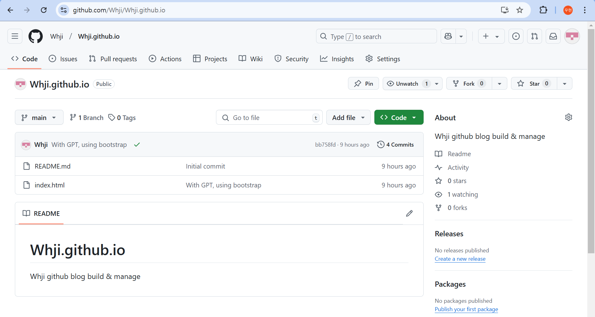
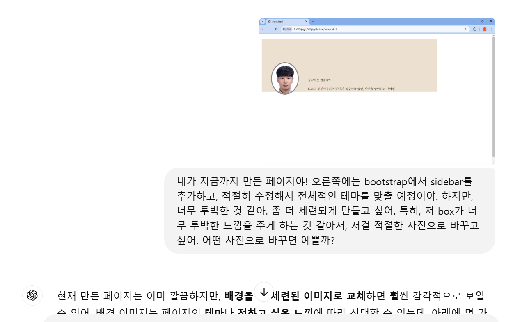
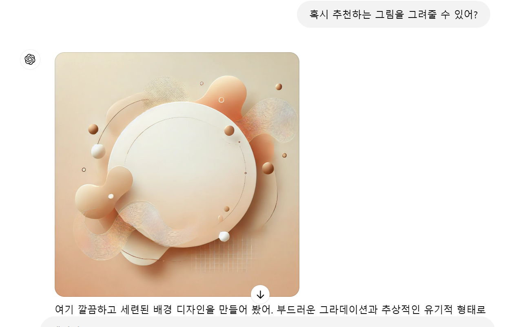

드디어 첫 프로젝트가 끝났다!  
사실 막 어려운 프로젝트라고 하기에는 좀 작고 소중한(?) 감이 없지 않아 있다 ㅋㅋㅋ  
프론트엔드의 프로그래밍 언어인 html/css/javascript 기반으로, (ChatGPT + StackOverflow, Tistory와 함께한) 나의 프로젝트 일기  
여기다가 적을 예정이다!  
(실은 운영하고 있는 네이버 블로그에서 개발 관련해서 설명한 부분들만 그대로 가져올 예정이다.)  

열심히 블로그 만드는 중이다.  

웹 사이트들이 어떤 식으로 작동하는 건지도 알았다.  

지금 내가 이해한 것으로는,   

쉽게 생각해서 대부분의 웹 페이지들은 각각이 하나의 파일이다.  

지금 화면에서 F12 눌러보면 화면 오른쪽에 어떤 코드가 뜰 건데, 위로 올려보면 <!doctype html> 로 시작하는 코드가 뜰 거다. 이 언어의 이름이 html이고, 이 언어를 기반으로 작성된 파일이 웹 페이지라고 생각하면 된다. 크롬, 사파리 같은 Web Browser들은 이 html 파일을 읽어주는 도구인 셈이다.  

  
깃허브 리포지토리 생성해서, 거기다가 index.html이라는 파일을 올려두었다.   

리포지토리 이름을 저렇게 생성해두면 https://username.github.io 라고 검색창에 쳤을 때 웹 페이지를 연동하도록 github에서 처리해준다. 그 웹 페이지에서 첫 화면에 뜨는 게 index.html 파일의 컨텐츠이다.  

​

자 그러면 블로그를 구현하려면 필요한 것은?   

가장 먼저 '이거 클릭하면 저 페이지 넘어가는' 게 필요하자나. 즉, 두 개의 html 파일을 연결하는 게 필요하겠지. 이모저모 공부해서 알아봤다.  

```html
<a href="파일 이름">클릭할 부분 이름</a> 
```
정확히 기억은 안 나는데.. 이런 류의 코드를 기반으로 연결할 수 있다고 한다.  

좋아. 그러면 이제 실제 블로그를 이쁘게 구성해야겠지?  

사실 많은 사람들이 지킬? 이라는 블로그 생성기를 사용한다고 하더라. 뭐 마크다운 어쩌구 해서 텍스트를 작성하면 그걸 기반으로 블로그를 딱 만들어주는.. 뭐 그런 거라던데.  

홍대병 걸린 나님은..  

기왕 이렇게 만들기 시작한 거, 처음부터 끝까지 내가 html css javascript 공부해서 깔쌈하게 만들어 낸다. 딱 대. 하는 마인드이기에...  

잠깐 여기서 깨알 상식) 왜 보통 웹사이트 만들 때에는 html, css, javascript 세 가지 언어를 사용하는 걸까?  

html은 앞서 이야기했던 것처럼 웹사이트를 다루고, 생성하고, 연결하는 가장 기본적인 언어이다. 쉽게 생각해서 집을 지어주는 역할이라 생각하면 됨.  

css는 (아직 사용은 안 해 봤지만) html기반으로 생성한 웹사이트에, 시각적인 효과를 풍부하게 더해주는 언어라고 한다. 집의 인테리어와 가구 배치 등등을 해 주는 언어.  

+12/26추가) css 사용해봤다.  

position: absolute랑 position: relative때문에 한참 씨름하고 있다. 살려줘  

javascript는 이렇게 만든 웹사이트에, 사용자와 인터렉티브한 요소들을 추가하고 매니징하는 언어라고 한다. 집에 일반 문 대신 자동문을 설치하고 매니징하는데 사용하는 언어.  

​

... 여하간 그래서, 블로그 제작기 대신 bootstrap이라는 html 라이브러리를 사용해보기로 마음먹었다. (Thx to GPT- 하다가 막히면 구글링 위주로 하다가 가끔 gpt하고도 이야기하는데, 이런 게 있다고 알려줬다.)  

​

문제는 bootstrap 라이브러리를 이용하려면, 결국 디자인을 하나부터 열까지 다 내가 해야 한다. 덜덜덜  

중딩 전교 7등으로 졸업한 갓생 지우현 씨마저(지금이랑은 다른 인간이다.), 3년 내리 아무리 노력해도 90점이 최고였던 '미술'을,   

'과연 내가 할 수 있을까?'  

여하간 도전해본다.  

그래서 블로그 자체를 어떻게 구성할지, 굿노트에 그려가며 열심히 고민중이었다.  

(붂흐러우니까 안 보여줄거임 이거능)  

이제 얼추 마무리되어 가니까 마무리짓고 구현할라구 한다.  

역시 컴퓨터는 재미있다.  

메인이 되는 box랑 javascript 기반으로 사이드바도 만들고, 헤더도 만들었다. (GPT랑 함께)  

특히 디자인을 처음에 단색 박스로 뽑았었는데, 뭔가 되게 밋밋해서 고민이었었다.  

GPT에게 부탁을 했더니  


